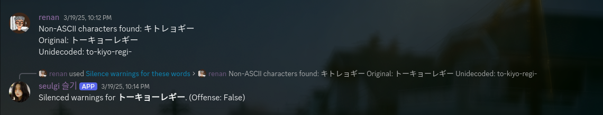
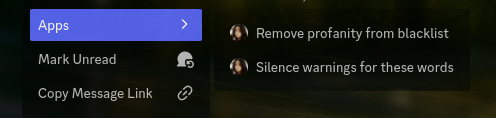
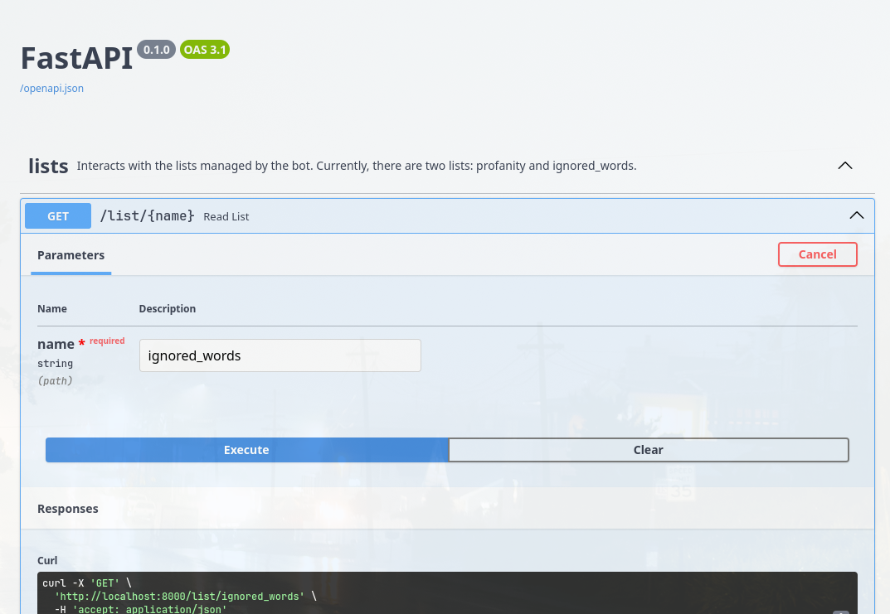

## wbor-manager-bot

A quick way of interacting with some alerts generated by WBOR projects (mainly [wbor-rds-encoder](https://github.com/WBOR-91-1-FM/wbor-rds-encoder)).
Currently, the bot is able to:
- add/remove words to the blacklist;
- add/remove words to the ignored list (meaning that, if they have unsupported UTF-8 characters or were classified as offensive, it won't trigger an alert);



Usage is pretty simple: right-click the alert message, click on "Apps" and choose what you want to do.



The bot also has a few commands to show statistics, add/remove words, and even import them from a JSON file. Type in / to see the available commands.

The word list can be accessed locally in the `generated/lists` folder, which contains the `profanity.json` and `ignored_words.json` files.
Additionally, lists can be retrieved via a REST API built with FastAPI.

The API container must be run separately from the bot - consult the `docker-compose.yml` file for more information.
Swagger is available at `/docs`.



### Installation

Before running, copy the `.env.example` file to `.env` and fill in the necessary fields.
You will need a bot token and the role ID that will allow users to interact with the bot.

#### Docker
```bash
docker-compose up -d
```
This will start 2 containers: one for the bot and another for the API, which will be available at `http://localhost:8000`.
#### Local setup
First, install the dependencies.
```bash
pip install -r requirements.txt
```

Then, run the bot.
```bash
python index.py
```
To run the API, use the FastAPI CLI:
```bash
fastapi dev server.py
```

